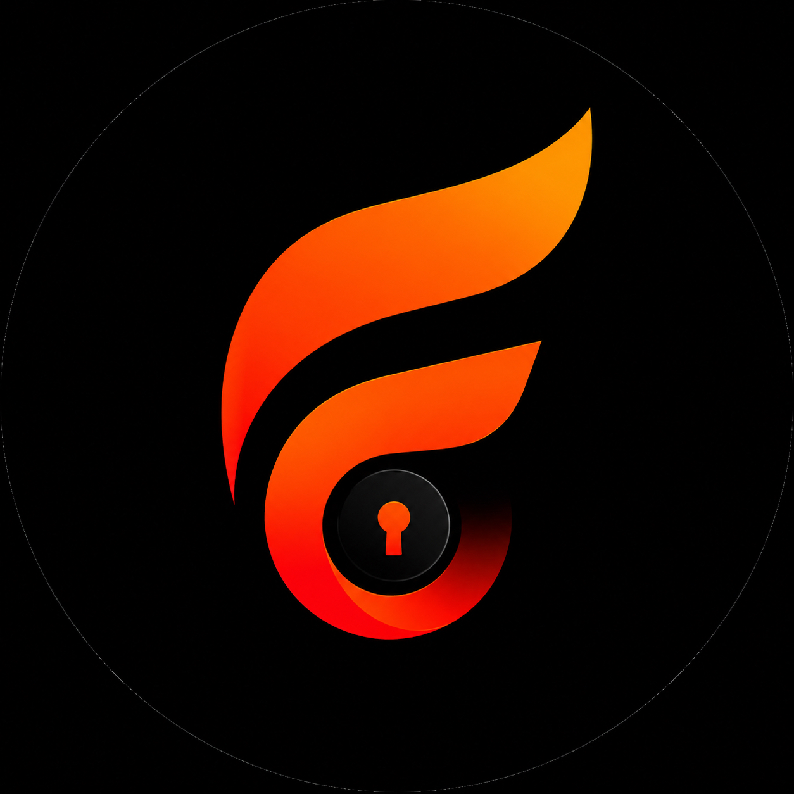
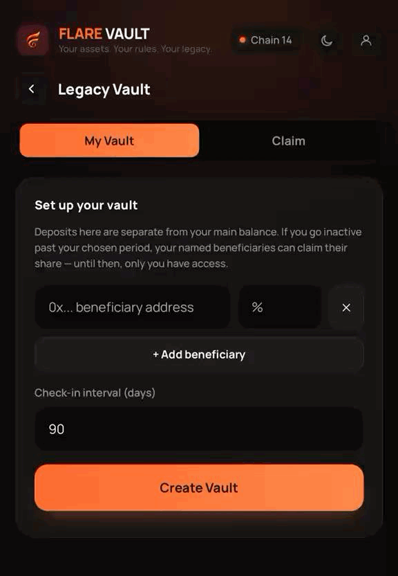
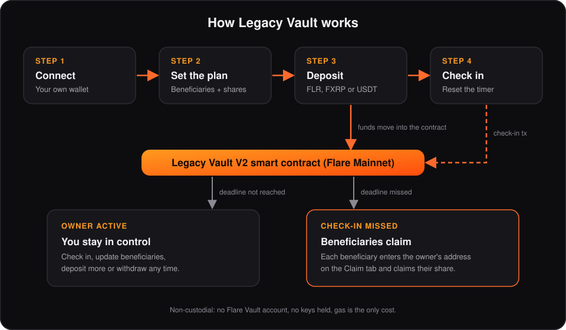

<div align="center">



# Flare Vault

**Your assets. Your control.**

A non-custodial vault for Flare Mainnet. Connect your own wallet to hold, send, receive and plan the future of your assets, without handing over your keys.

[Website](https://www.flarevaultapp.xyz/) · [X / Twitter](https://x.com/flare_vault) · [Support](mailto:support@flarevaultapp.xyz)

-ff6a2c)


</div>

---

## Overview

Digital assets are easy to lose track of. When access to a wallet is lost, or an owner becomes unavailable, family and beneficiaries often have no way to reach what was left behind.

**Flare Vault** makes asset continuity simple on the Flare network. You stay in full control during your lifetime, and you decide who receives your assets, how much each person receives, and how long you can be inactive before they can claim.

There is **no Flare Vault account**. Your wallet is your login, and there is no sign-up, email or password.

### Principles

| Principle | What it means |
|---|---|
| **Self-custody** | Flare Vault never holds your keys. It cannot move funds without you approving the exact transaction in your own wallet, and it never asks for a recovery phrase or private key. |
| **Privacy first** | The app only sees your public wallet address and on-chain data, which anyone can already read on a block explorer. |
| **Transparency** | Every contract used is public and verifiable on the Flare explorer. Fees are shown before you confirm. |
| **Simplicity** | Four steps for Legacy Vault: connect, set the plan, deposit, check in. |

---

## Features

- **Wallet connection**: MetaMask, Trust Wallet, Coinbase Wallet, Rainbow, or any WalletConnect-compatible wallet, in-browser or on mobile.
- **Balances and history**: view FLR, FXRP and bridged USDT balances plus transaction history on Flare Mainnet.
- **Send and receive**: move FLR and supported tokens directly from your wallet to any address, with a review step before you confirm.
- **NFTs**: view, receive and send ERC-721 and ERC-1155 NFTs on Flare. NFTs that do not auto-appear can be added by contract address and token ID, with on-chain ownership verification.
- **Legacy Vault V2**: an on-chain inheritance contract. Name beneficiaries and shares, deposit assets, and check in on a schedule you choose. If a check-in is missed, beneficiaries claim their share directly from the contract.
- **Appearance settings**: theme and display preferences stored locally on your device.

<div align="center">



*Legacy Vault setup: add beneficiaries, set a check-in interval, create the vault.*

</div>

---

## Feature Status

A feature is only labelled as available once it is live on mainnet.

| Feature | Status |
|---|---|
| Wallet connection, balances, history | Live |
| Send and receive FLR, FXRP, bridged USDT | Live |
| My NFTs: view, receive, send | Live |
| Legacy Vault V2 (inheritance) | Live on Flare Mainnet |
| Swap through SparkDEX V3 | Launching soon |
| Stake FXRP through Firelight stXRP | Launching soon |
| FXRP as collateral | Coming soon |
| 555 NFT collection | In development, waitlist open |

---

## How It Works

| Action | What happens to your assets |
|---|---|
| **Connect wallet** | Nothing moves. The site reads public data about your address. |
| **Send FLR, tokens or NFTs** | Assets go directly from your wallet to the address you enter. Flare Vault never touches them in between. |
| **Receive** | Assets sent to your address arrive in your own wallet. Only Flare-network assets should be sent to it. |
| **Legacy Vault deposit** | The FLR, FXRP or USDT you deposit moves into the Legacy Vault smart contract. You can withdraw any amount while the vault is active. |
| **Swap** *(launching soon)* | Executed through SparkDEX V3 liquidity pools. The result is sent to your wallet. |
| **Stake FXRP** *(launching soon)* | Deposited through the Firelight stXRP vault. Network gas applies. |

If your wallet is on another network, Flare Vault asks it to switch to **Flare Mainnet (chain ID 14)**. You need a small amount of **FLR** to pay network gas for any transaction.

---

## Legacy Vault (Inheritance)

Legacy Vault V2 is a public smart contract on Flare. Everything happens between your wallet and that contract, with no accounts and no middlemen.

1. **Connect** your wallet.
2. **Set the plan.** Add beneficiary addresses and assign each a share (shares must total 100%). Choose how often you will check in, in days.
3. **Deposit.** Move FLR, FXRP or USDT into the contract. Deposits are separate from your main wallet balance.
4. **Check in.** A check-in transaction resets the timer. If the deadline passes without a check-in, each beneficiary can claim their share from the contract.

While the vault is active you can check in, update beneficiaries, deposit more, and withdraw. A beneficiary claims by entering the vault owner's address on the **Claim** tab and confirming the transaction from their own wallet.

<div align="center">



</div>

### The trade-off

Funds you deposit are held by the Legacy Vault smart contract, not by your wallet. That is what lets beneficiaries claim without you, and it means you rely on that contract's code. Choose a check-in interval you can reliably keep. If you lose your wallet, Flare Vault cannot recover it, but funds placed in Legacy Vault can still be claimed by your beneficiaries after the interval ends.

> **No third-party security audit of the Legacy Vault contract has been published yet.** The source is verified and public on the Flare explorer. Read it, and deposit only what you are comfortable placing in a smart contract.

---

## Fees

| Feature | Cost |
|---|---|
| Send FLR, tokens and NFTs | Network gas only. No Flare Vault fee. |
| Legacy Vault (deposit, check-in, claim) | Network gas only. No Flare Vault fee. |
| Stake FXRP *(launching soon)* | Network gas. No Flare Vault fee. |
| Swap *(launching soon)* | Pool fee tier + network gas + **0.25% Flare Vault fee**. Full breakdown shown before you confirm. |

The swap fee, once swaps launch, is paid to the public address
[`0x008dfa020B48417cFA5c4ED95A2c572A11eD04D7`](https://flare-explorer.flare.network/address/0x008dfa020B48417cFA5c4ED95A2c572A11eD04D7).

---

## Security Model

### Implemented protections

- No key handling: no recovery phrase or private key is ever requested, received or stored.
- Exact-amount token approvals, never unlimited.
- Full transaction details shown in your own wallet before signing.
- On-chain ownership checks before any NFT is sent; transfers to your own address or to the NFT's own contract are blocked.
- Text and images from external sources (such as NFT metadata) are rendered safely.
- HTTPS with a Content Security Policy and other security headers.
- Public, verified contract source on the Flare explorer.

### Known limitations

- No published third-party audit of the Legacy Vault contract yet.
- The app depends on outside infrastructure: the wallet-connection service, Flare RPC providers and the block explorer.
- NFT names and images are created by third parties. Treat unknown NFTs with care and never open links or connect to sites advertised inside them.

### Staying safe

- Always check the address bar (`www.flarevaultapp.xyz`) before connecting a wallet.
- If any page claiming to be Flare Vault asks for a recovery phrase or private key, close it.
- Read every prompt in your wallet. Reject anything you did not start.

---

## Privacy

| Data | Where it lives |
|---|---|
| Wallet address, balances, NFTs, transactions | Public on the blockchain. Read and processed in your browser. |
| Theme, last wallet type, waitlist marker, manually added NFTs | Stored on your device only (`localStorage`). |
| Waitlist form (wallet address, X and Telegram usernames, timestamp) | Optional. Sent to a spreadsheet controlled by the team (Google Apps Script and Google Sheets). Deletion on request. |
| Everything else | Not collected. There is no server-side user database. |

Flare Vault does not keep a database of wallets that connect and does not sell personal information. The full policy is available in the app under **Privacy Policy**.

---

## Tech Stack

Flare Vault is a **dependency-light, single-file web application** (`index.html`) containing its own HTML, CSS and JavaScript, with libraries loaded from CDNs.

| Layer | Technology |
|---|---|
| UI | Vanilla HTML, CSS and JavaScript |
| Blockchain library | [ethers.js](https://docs.ethers.org/v6/) v6.13.4 |
| Wallet connection | [Reown AppKit](https://docs.reown.com/appkit/overview) with the Ethers adapter, plus [WalletConnect Ethereum Provider](https://docs.walletconnect.com/) v2.17.0 as a fallback |
| QR codes | qrcode.js 1.0.0 |
| Network | Flare Mainnet, chain ID `14`, native token FLR |
| Data sources | Flare explorer API (`flare-explorer.flare.network`) and Flare RPC providers (with fallbacks) |
| Integrations (upcoming) | SparkDEX V3 (swaps), Firelight stXRP (staking) |

CDN scripts are loaded with fallbacks (jsDelivr and unpkg), and the app falls back to a simpler WalletConnect modal if AppKit is unavailable.

---

## Project Structure

```text
.
├── index.html     # The entire app: markup, styles, scripts, SEO metadata
├── assets/
│   ├── logo.jpg                  # Project logo
│   ├── legacy-vault-demo.gif     # Legacy Vault setup demo
│   └── legacy-vault-flow.svg     # Legacy Vault flow diagram
└── README.md
```

Inside `index.html`, the content is organised into:

- **Landing page**: features, how it works, safety, fees, trust, FAQ.
- **Information pages**: About, Documentation, Privacy Policy, Contact.
- **App screens**: Assets, Legacy Vault (setup, status, balance, claim, history), My NFTs, Send, Receive, Swap, Stake, 555 Collection waitlist, Settings.
- **Wallet layer**: AppKit initialisation and the Flare network configuration.

---

## Getting Started

### Prerequisites

- A modern browser.
- A Flare-compatible wallet (MetaMask, Trust Wallet, Coinbase Wallet, Rainbow, or any WalletConnect wallet).
- A small amount of FLR for gas.
- Any static file server for local development.

### Run locally

```bash
# Clone the repository
git clone <your-repository-url>
cd <your-repository-folder>

# Serve the folder with any static server, for example:
python3 -m http.server 8080
# or
npx serve .
```

Open `http://localhost:8080` in your browser.

> Wallet connections through WalletConnect and AppKit require your domain (including `localhost` during development) to be allowed in your Reown project settings.

### Debug mode

Append `?debug=1` to the URL to enable additional wallet-connection diagnostics.

---

## Configuration

| Setting | Location | Purpose |
|---|---|---|
| `WALLETCONNECT_PROJECT_ID` | `index.html` | Your Reown / WalletConnect Cloud project ID. |
| `chainId: 14` | `index.html` | Flare Mainnet network definition. |
| `featuredWalletIds` | AppKit setup in `index.html` | Wallets highlighted first in the connect modal (MetaMask, Trust Wallet, Coinbase Wallet, Rainbow). |
| `themeMode` / `--w3m-accent` | AppKit setup in `index.html` | Wallet modal theme (dark, accent `#ff6a2c`). |
| `fv-build` meta tag | `<head>` | Build identifier for cache and version tracking. |

---

## Deployment

Because the app is a static file, it can be hosted on any static host (Cloudflare Pages, Netlify, Vercel, GitHub Pages, S3 with a CDN, and so on).

Recommended production checklist:

- [ ] Serve over **HTTPS** only.
- [ ] Set security headers, including a strict **Content Security Policy**, `X-Content-Type-Options`, `Referrer-Policy` and frame protections.
- [ ] Allow-list your production domain in the Reown / WalletConnect project.
- [ ] Confirm the canonical URL, Open Graph image (`og-image.jpg`, 1200x630) and social metadata match your domain.
- [ ] Verify contract addresses against the table below before each release.

---

## Contracts and Addresses

All on **Flare Mainnet (chain ID 14)**. Open any of them on the [Flare explorer](https://flare-explorer.flare.network/) to read the code, balances and transaction history yourself.

| Contract | Address |
|---|---|
| Legacy Vault V2 | [`0x78fEED9912944061519E975de51d60e1857D2d87`](https://flare-explorer.flare.network/address/0x78fEED9912944061519E975de51d60e1857D2d87) |
| FXRP (XRP on Flare) | [`0xAd552A648C74D49E10027AB8a618A3ad4901c5bE`](https://flare-explorer.flare.network/address/0xAd552A648C74D49E10027AB8a618A3ad4901c5bE) |
| USDT (bridged) | [`0x0B38e83B86d491735fEaa0a791F65c2B99535396`](https://flare-explorer.flare.network/address/0x0B38e83B86d491735fEaa0a791F65c2B99535396) |
| Swap fee recipient | [`0x008dfa020B48417cFA5c4ED95A2c572A11eD04D7`](https://flare-explorer.flare.network/address/0x008dfa020B48417cFA5c4ED95A2c572A11eD04D7) |

---

## Roadmap

- [x] Wallet connection, balances and history
- [x] Send and receive FLR, FXRP and bridged USDT
- [x] NFT viewing, receiving and sending (ERC-721 and ERC-1155)
- [x] Legacy Vault V2 live on Flare Mainnet
- [ ] Token swaps via SparkDEX V3
- [ ] FXRP staking via Firelight stXRP
- [ ] Borrowing against FXRP (FXRP as collateral)
- [ ] 555 NFT collection
- [ ] Published third-party security audit of Legacy Vault

---

## Reporting a Vulnerability

Please report security issues privately. **Do not open a public issue.**

Email **support@flarevaultapp.xyz** with the subject line **`Security report`**, including a description, reproduction steps and potential impact.

---

## Contributing

Questions, partnership ideas and feedback are welcome.

- General and technical support: support@flarevaultapp.xyz
- Official updates: [@flare_vault on X](https://x.com/flare_vault)

If you plan a code contribution, please open an issue first to discuss the change. Keep changes focused, and do not introduce anything that handles private keys or recovery phrases.

---

## License

Copyright © 2026 Flare Vault. All rights reserved.

*(Replace this section if you publish the code under an open-source license, and add a matching `LICENSE` file.)*

---

## Disclaimer

Flare Vault is non-custodial software provided as-is. It is not financial, legal or estate-planning advice. Blockchain transactions are irreversible, and smart contracts carry risk, including bugs and unaudited code. You are responsible for safeguarding your wallet, verifying addresses and understanding what you approve. Only deposit what you are comfortable placing in a smart contract, and always verify you are on the official domain before connecting a wallet.
